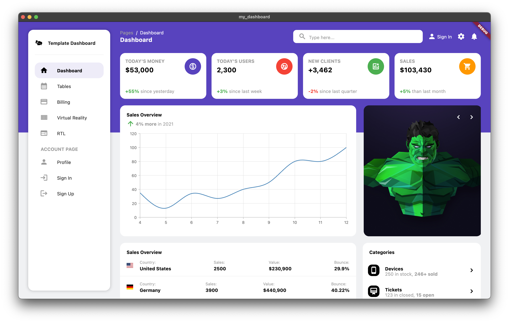
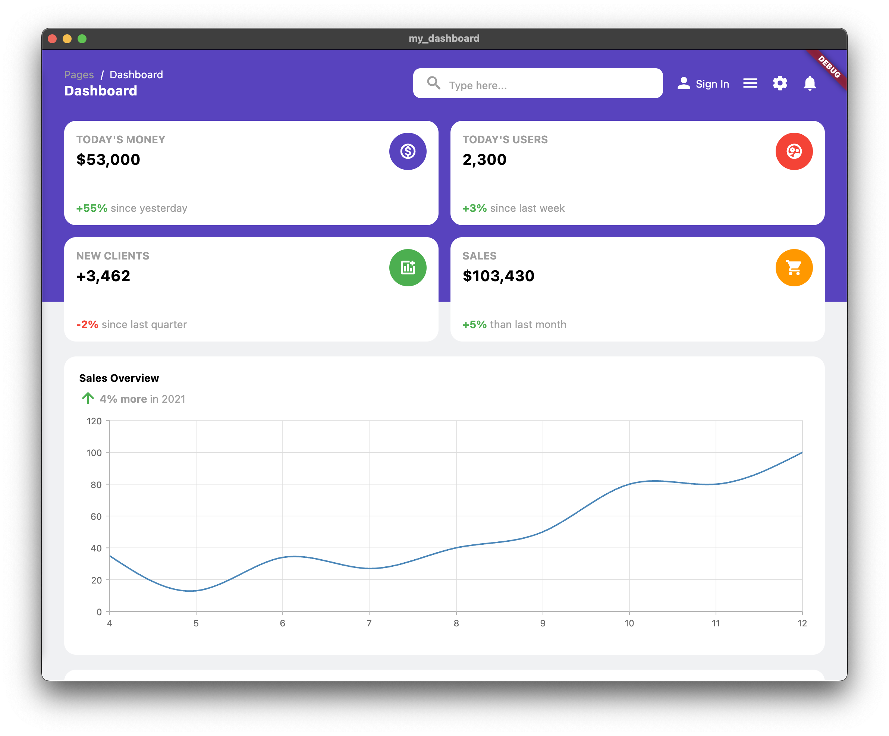

# my_dashboard

my_dashboard is a dashboard template with a responsive design for Desktop, Tablet, and Mobile resolution.
Made with Flutter 💙 3.0.5

https://drive.google.com/file/d/13pzpxSPHWtlAbInhqkruhup4UaLlvlCr/view?usp=sharing

## Motivation

Inspired by a dashboard template called [argon-dashboard](https://demos.creative-tim.com/argon-dashboard/pages/dashboard.html). Currently my_dashboard just has on single page demo, open for contribution. Feel free to create a PR for a new enhancement and stuff. ALl contributions are welcome 🙌🏻

  

  

  

Happy coding 👊🏻

