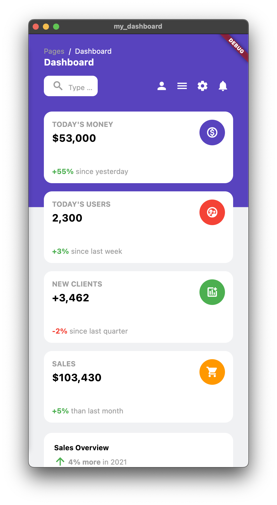

# my_dashboard

my_dashboard is a dashboard template with a responsive design for Desktop, Tablet, and Mobile resolution.
Made with Flutter 💙 3.0.5

https://user-images.githubusercontent.com/44092368/196969017-02c09b25-d3b7-4126-8c28-019b5838dcb6.mp4

## Motivation

Inspired by a dashboard template called [argon-dashboard](https://demos.creative-tim.com/argon-dashboard/pages/dashboard.html). Currently my_dashboard just has on single page demo, open for contribution. Feel free to create a PR for a new enhancement and stuff. ALl contributions are welcome 🙌🏻

Desktop resolution:
  

Tablet resolution:
  

Mobile resolution:
  

Happy coding 👊🏻
